# Juegos garabatos

Dos sistemas de juegos (baraja + tablero y fichas) basados en los personajes e historias del Señor Garabato, con los que pueden jugarse multitud de juegos diferentes.

## La baraja

La baraja contiene varios sistemas de juego distintos además del de una baraja estándar, con lo que son posibles un mayor número de juegos y actividades.

### Descripción del contenido de la carta

En la esquina superior izquierda, la carta tiene un valor (1-10, A, B, C) y un color (rojo, azul, verde, amarillo). Esta estructura es equivalente a la de una baraja de póker estándar.

La imagen central es única para cada valor. Las cartas con valores del 1-10 tienen un dibujo del Señor Garabato en una posición distinta para cada una de ellas.

|||||
|-------------------------|-------------------------|-------------------------|-------------------------|
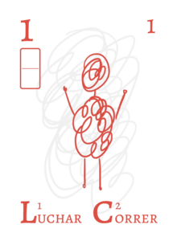  |  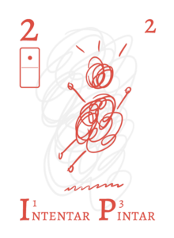 |  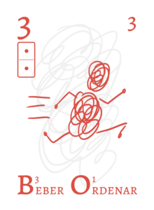
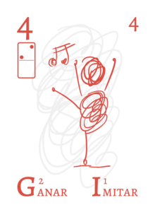  |  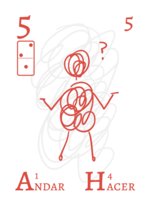 |  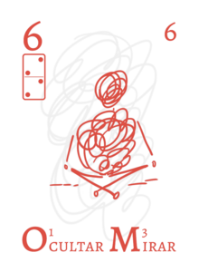
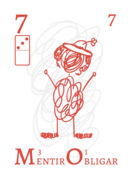  |  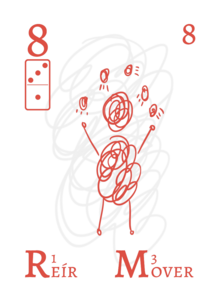 |  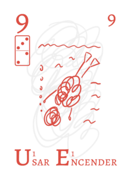
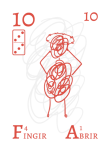 | |

Las figuras (A, B, C) tienen dibujos de los personajes secundarios (la pequeña Garabata, la Señora Garabata y la gatita)

||||
|-------------------------|-------------------------|-------------------------|
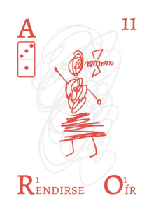  |  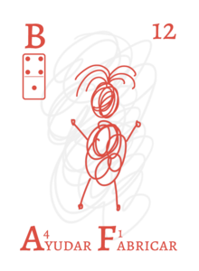 |  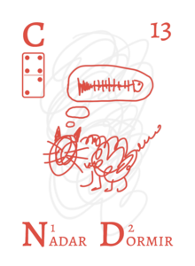

Hay 4 comodines (jokers), indicados con la letra X y con un diseño que combina los cuatro colores.

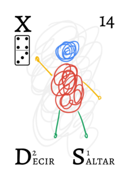

Bajo el valor aparece una ficha de dominó. Tomando las cartas del 1 al 28 o del 29 al 56 se tienen un juego de dominó completo.

En la esquina superior derecha, las cartas están numeradas del 1 al 56, lo que permite jugar a juegos que utilicen tan solo el valor numérico de cada una de las cartas

En la parte inferior aparecen dos palabras. La temática de las palabras está definida por el color, según lo siguiente:

- Verde: Naturaleza
- Azul: Acciones
- Rojo: Objetos y elementos genéricos
- Amarillo: Ideas abstractas

Estas palabras pueden usarse para desarrollar historias, a la manera de los _Story Cubes_ u otras herramientas similares.

Las letras iniciales de cada palabra pueden utilizarse para juegos que requieran letras, tales como Scrabble o similares de formación de palabras. Pueden emplearse las letras iniciales de la primera palabra, de la segunda, o pudiendo el jugador elegir cualquiera de ambas, según sea más conveniente de acuerdo con el juego. Con cualquiera de esas alternativas, la distribución de las letras sigue la frecuencia aproximada de aparición en español.

Junto a cada letra inicial aparece una puntuación, determinada por la frecuencia de la letra en cuestión, a utilizar en aquellos juegos que así lo necesiten.

La parte trasera de las cartas no es igual para todas ellas. El garabato central se encuentra unido a los distintos lados de la carta por cero, una, dos, o tres lineas.

||||
|-------------------------|-------------------------|-------------------------|
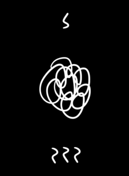  |  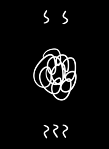 |  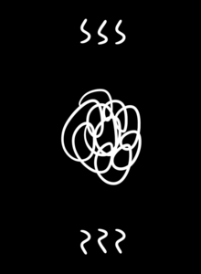

De esta manera, puede utilizarse para formar laberintos y jugar a juegos que se basen en formación de puzles y conexión de cartas.

Las cartas del 1 al 34 se corresponden con las del sistema de juego Zoki. (más información [aquí](https://escaleajeux.fr/z/zoki__patent.pdf) y [aquí](https://boardgamegeek.com/image/133834/zoki))

Las restantes no siguen ningún esquema particular.

## Las losetas y fichas

El conjunto de losetas, fichas y peones está basado en la estructura de Piecepack, un sistema de juegos que permite jugar un gran número de juegos distintos.

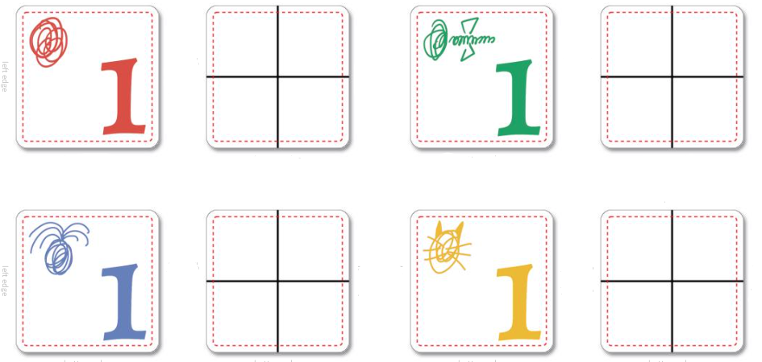

 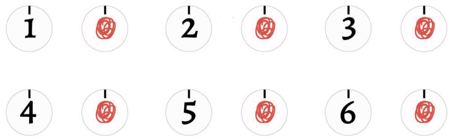

Más información sobre Piecepack, con descripción de juegos, puede encontrarse [aquí](https://piecepack.net/).

